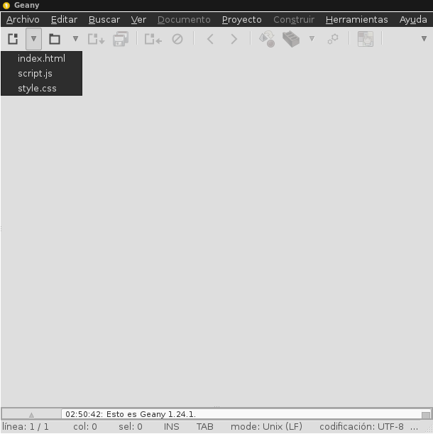

Hola, hoy veremos como configurar Geany para crear automáticamente nuestros archivos html, css y javascript.<!--more-->

Para empezar tenemos que abrir nuestro explorador de archivos con privilegios de súper usuario.

$ gksu "explorador" /usr/share/geany/templates/files

Sustituyendo "explorador" por nuestro programa favorito e.g. Nautilus. Dentro de esta carpeta encontraremos varios archivos html, c, c#, ruby, etc. Estos archivos podremos editarlos a nuestra preferencia o borrarlos si no los necesitamos. Estos archivos se enlistan en el botón "Nuevo" en nuestra interfaz de Geany.

\[caption id="" align="alignnone" width="610"\] Geany\[/caption\]

Así si necesitamos crear un archivo html5 podemos crear nuestro archivo en el cual especificaremos el DOCTYPE para esta versión, además si estamos acostumbrados a nombrar nuestras hojas de estilo o scripts de la misma manera podemos especificar las etiquetas correspondientes a la hora de abrir un nuevo html. Igual si estamos acostumbrados a crear un contenedor dentro de <body> podremos hacerlo. Dentro de esta carpeta podremos tener varios archivos de la misma extensión para nuestros diferentes proyectos. De la misma manera podremos predefinir hojas de estilo, scripts, y en el caso de programar en C podemos incluir diferentes librerías.
