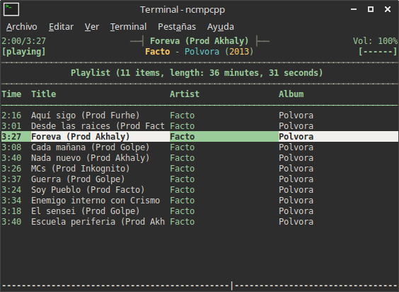
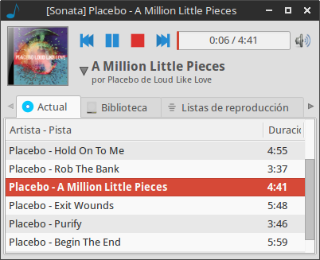

[](https://moelinux.files.wordpress.com/2015/04/screenshot-290415-221614.png) ncmpcpp

Esto les servirá para instalar y configurar de forma local mpd (music player daemon) y ncmpcpp, el cual es un cliente de terminal para mpd.<!--more-->

Lo primero que tenemos que hacer es instalar los paquetes según su distribución, los cuales se pueden encontrar en los repositorios oficiales de Archlinux y Ubuntu, entre otros.

```shell
$ sudo apt-get install mpd ncmpcpp
```

Ahora tenemos que parar el demonio de mpd para poder configurarlo

```shell
$ /etc/init.d/mpd stop
```

Y ahora quitamos mpd del inicio del sistema

```shell
$ sudo update-rc.d mpd disable
```

Extraemos un archivo comprimido -no forzosamente se llama "mpd.conf.gz"

```shell
$ gunzip -c /usr/share/doc/mpd/examples/mpd.conf.gz > ~/.mpdconf
```

Editamos el mismo archivo con nuestro editor de texto favorito, en mi caso lo abro con Geany.

```shell
$ geany ~/.mpdconf
```

Y ponemos el siguiente contenido:

```shell
music_directory      "~/Música"
playlist_directory   "~/.mpd/playlist"
db_file              "~/.mpd/tagg_cache"
log_file             "~/.mpd/mpd.log"
#error_file          "~/.mpd/errors.log"
pid_file             "~/.mpd/pid"
state_file           "~/.mpd/state"
 
audio_output {
    type          "pulse"
    name          "My Pulse Output"
    ##    server  "remote_server"
    # optional 
    ##    sink    "remote_server_sink"    
    # optional
}
##Visualizacion
audio_output {
    type     "fifo" 
    name     "my_fifo" 
    path     "/tmp/mpd.fifo" 
    format   "44100:16:2"
}
```

Creamos el folder de playlist

```shell
$ mkdir -p ~/.mpd/playlists
```

Creamos los archivos necesarios

```shell
$ touch ~/.mpd/{database,log,pid,state,sticker.sql}
```

Ejecutamos mpd

```shell
$ sudo mpd
```

**Tal vez salga algún error en la terminal, pero no hay mayor problema.** Ahora configuramos ncmpcpp; lo primero será editar el archivo config

```shell
$ sudo geany /usr/share/doc/ncmpcpp/config
```

Y colocamos lo siguiente:

```shell
$ mpd_host     “localhost” mpd_port     “6600” mpd_music_dir     “~/Música”
```

Ahora creamos la carpeta y el archivo de configuración.

```shell
$ mkdir ~/.ncmpcpp
$ touch ~/.ncmpcpp/config
$ geany ~/.ncmpcpp/config
```

Y colocamos lo siguiente:

```shell
mpd_music_dir                        = ~/Música" 
playlist_display_mode                = columns" 
song_status_format                   = %t{ - %a}{ - %b}{ (%y)}" 
song_window_title_format             = MPD: {%a - }{%t}|{%f}" 
song_columns_list_format             = (7)[green]{l} (35)[white]{t} (28)[green]{a} (28)[white]{b}" 
user_interface                       = alternative" 
progressbar_look                     = -|-" 
display_screens_numbers_on_start     = no" 
allow_physical_files_deletion        = no" 
allow_physical_directories_deletion  = no" 
colors_enabled                       = yes" 
progressbar_color                    = green" 
volume_color                         = greeen" 
header_window_color                  = green" 
main_window_color                    = green" 
#now_playing_prefix                  = $b$u" 
#now_playing_suffix                  = $/b$/u"
#visualizacion visualizer_fifo_path  = /tmp/mpd.fifo" 
visualizer_output_name               = my_fifo" 
visualizer_sync_interval             = 30" 
visualizer_in_stereo                 = yes" 
#visualizer_type                     = wave" (spectrum/wave) 
```

Dentro de este archivo se encuentra la configuración de los colores y estructura del cliente. Pueden encontrar más archivos de configuración de ncmpcpp en [dotshare](http://dotshare.it). Esta misma configuración les servirá otro cliente de mpd, como Sonata.

[](https://moelinux.files.wordpress.com/2015/04/screenshot-290415-222117.png) Sonata
