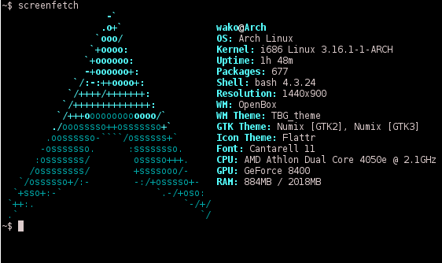
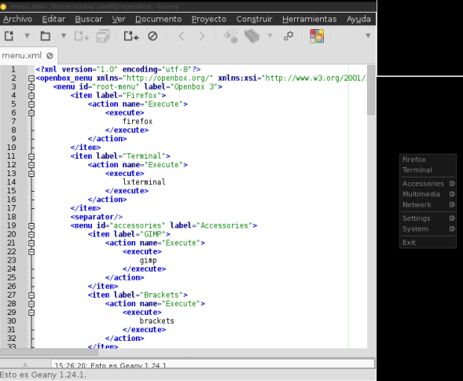

Al instalar Arch Linux con Openbox podrán notar que practicamente no tienen software en su equipo, no hay explorador para los archivos, ni navegador web, ni reproductor de música. Necesitarán varias herramientas para tener su sistema a punto. Estas son las herramientas que podrán utilizar:<!--more-->

- Tint2: Un panel bastante sencillo que consume muy pocos recursor.
- oblogout: Para apagar, reiniciar o suspender el equipo sin la terminal.
- Pcmanfm: Un explorador de archivos. Para que los dispositivos externos funcionen correctamente necesitaremos instalar **gvfs**.
- Nitrogen: Para poner fondos de pantalla.
- Viewnior: Un visor de imágenes.
- File-Rolle: Gestor de archivadores.
- xfce4-screenshooter: Para tomar capturas de pantalla.
- xcursor-vanilla-dmz: Un tema para el cursor bastante bonito.
- Transmission-gtk: Un cliente para Torrents.
- volumeicon: Para controlar el volumen de nuestro sistema.
- simplescreenrecorder: Para tomar video de nuestro escritorio. Cuenta con opciones para tomar una zona determinada o una ventana.

Tendremos que poner en el archivo autostart los programas que queremos que se inicien automáticamente e.g. Nitrogen, Volumeicon, Tint2, etc.

> \## Wallpaper nitrogen --restore & ## Tint2 tint2 &t ## Network manager applet #(sleep 4s && nm-applet) & #Dropbox (sleep 3s && dropboxd) & ## Conky (sleep 3s && conky -q) & ## Volumeicon (sleep 5s && volumeicon) &

Las oraciones que comienzan con un **#** son comentarios.

\[caption id="attachment\_68" align="alignnone" width="562"\] Screenfetch\[/caption\]

Para comenzar a editar el menu de Openbox tendremos que fijarnos en el xml que es realmente sencillo, e.g.

\[caption id="" align="alignnone" width="589"\] Menu Openbox\[/caption\]

Todo comienza dentro de **<menu id="root-menu" label="Openbox 3"></menu>** dentro de esto podremos nuestros programas, menus desplegables y separadores. Siguiendo la sintaxis de xml de abrir y cerrar etiquetas.
