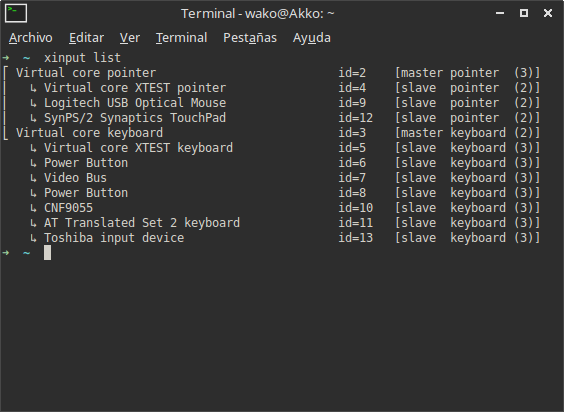

Yo soy una persona que acostumbra mover el touchpad de la laptop mientras escribe, esto me causa muchas molestias ya que puedo borrar texto accidentalmente -algo que me pasa muy seguido- o di click en algún lugar y ya no puedo escribir. Muchas laptops tienen algún botón o combinación de botones para desactivarlo, pero en algunos casos -como el mío- este botón no funciona correctamente. Para estos casos podemos utilizar un comando en la terminal.<!--more-->

Escribimos:

```shell
$ xinput list
```

Esto nos mostrará una lista de dispositivos, en los cuales tendremos que localizar el touchpad.

[](https://moelinux.files.wordpress.com/2015/05/screenshot-260515-214226.png)

En mi caso mi touchpad tiene el id 12, número que necesito para desactivarlo mediante el siguiente comando:

```shell
$ xinput set-prop 12 "Device Enabled" 0
```

Para activarlo simplemente cambiamos el 0 por un 1 en el mismo comando:

```shell
$ xinput set-prop 12 "Device Enabled" 1
```

De esta manera pueden activar y desactivar el touchpad de sus laptops con la terminal, pero es algo muy poco practico, lo que podemos solucionar colocando un par de alias en nuestro archivo bashrc o zshrc de la siguiente forma:

```shell
alias touchoff='xinput set-prop 12 "Device Enabled" 0'
alias touchon='xinput set-prop 12 "Device Enabled" 1'
```

De esta manera podremos controlar de manera más sencilla el apagado y encendido.
