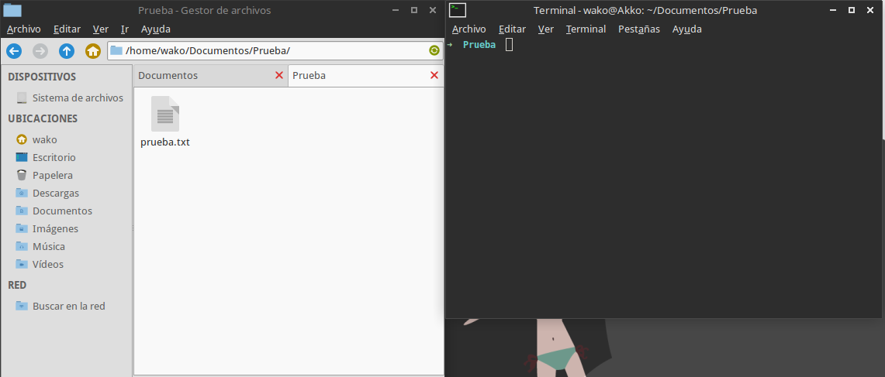
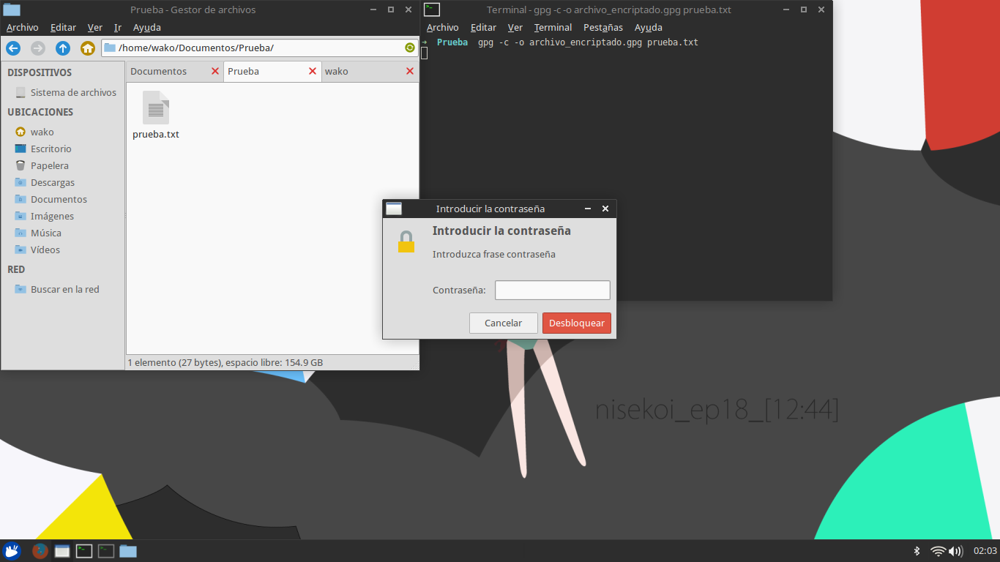

Encriptar información con GPG es mucho más simple de lo que parece. Lo primero que tendremos que hacer es asegurarnos de tener instalado el paquete en nuestra distribución GNU/Linux, en caso de no tenerlo lo podemos encontrar en los repositorios como **gnupg**.<!--more-->

> \# apt-get install gnupg

Ya con la herramienta instalada procedemos a crear la pareja de claves:

> $ gpg -gen-key

A lo cual nos pedirá cierta información (Tipo de llave, periodo de validez, nombre, comentario, correo electrónico y contraseña). Al terminar podemos verificar la existencia de las llaves con:

> $ gpg -list-keys

Podemos ver las llaves privadas registradas con el comando:

> $ gpg -list-secret-keys

Ya estamos listos para encriptar un archivo, en este ejemplo vamos a contar con un archivo de prueba llamado prueba.txt y crearemos una versión encriptada de éste llamada archivo\_encriptado.gpg

> $ gpg -c -o archivo\_encriptado.gpg prueba.txt

\[caption id="attachment\_87" align="alignnone" width="1141"\] Encriptar archivos con gpg\[/caption\]

Acto seguido nos pedirá una contraseña, la cual será la contraseña que servirá para poder desencriptar el archivo resultante.

Ya tenemos un nuevo archivo con extensión gpg, este archivo está completamente encriptado. Para poder desencriptarlo usamos:

> gpg -o nuevo\_archivo.txt -d archivo\_encriptado.gpg

Lo cual nos pedirá la contraseña del archivo que escribimos anteriormente.

\[caption id="attachment\_89" align="alignnone" width="1200"\] Encriptar archivos con gpg\[/caption\]

Para encriptar carpetas es un proceso similar, pero usaremos el comando gpg-zip. En este ejemplo vamos a tener una carpeta llamada carpeta\_de\_prueba la cual contiene algunos archivos de texto. Al igual que los archivos, el encriptar directorios nos pedirá una contraseña para poder desencriptarlos.

> $ gpg-zip -c -o carpeta\_encriptada.gpg carpeta\_de\_prueba

Esto nos generará un archivo gpg que contiene nuestro directorio encriptado. Para desencriptarlo utilizamos:

> $ gpg-zip -d carpeta\_encriptada.gpg

Ahora ya saben como encriptar sus archivos y directorios de manera sencilla.
