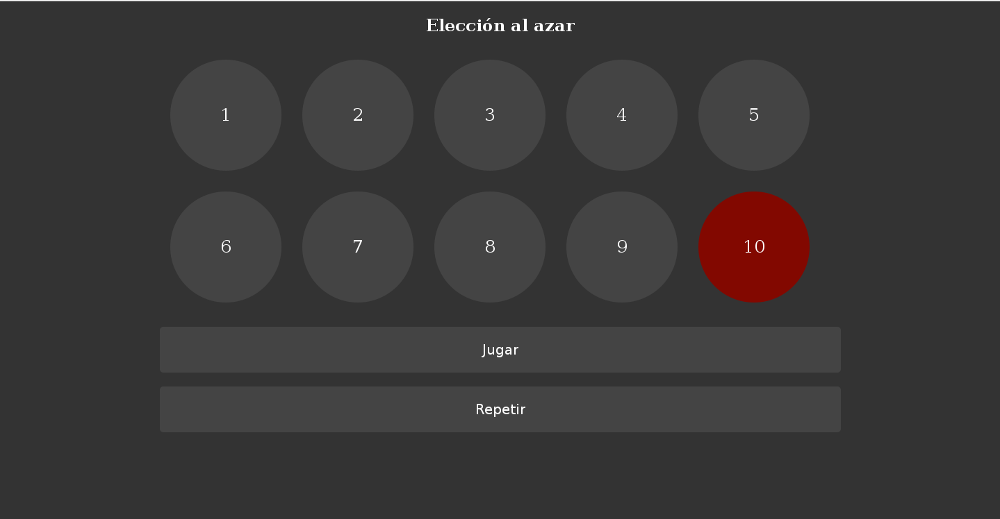

Hace un tiempo tuve que hacer una especie de 'tombola' para seleccionar un número al azar. Algo similar a [Random.org](http://www.random.org/) pero de una forma un poco más vistosa. Así que decidí hacer mi propio generador de número random con HTML5 y Javascript. <!--more-->

Lo primero que haremos será descargar [jQuery](http://code.jquery.com/jquery-2.1.1.min.js "jQuery") (lo guardamos con Ctrl+S) y lo renombraremos a jQuery-min; ya con la librería pasaremos a crear nuestro 'tablero' con html e.g.

```html
<!DOCTYPE HTML>
<html>

<head>
  <meta charset="utf-8">
  <title>Tombola</title>
  <link rel="stylesheet" href="style.css" />
  <script type="text/javascript" src="jQuery-min.js"></script>
  <script type="text/javascript" src="jQuery.js"></script>
</head>

<body>
  <div id="wrap">
    <header>
      <h2>Elección al azar</h2>
    </header>
    <div id="bolitasWrap">
      <div class="bolitas" id="uno">1</div>
      <div class="bolitas" id="dos">2</div>
      <div class="bolitas" id="tres">3</div>
      <div class="bolitas" id="cuatro">4</div>
      <div class="bolitas" id="cinco">5</div>
      <div class="bolitas" id="seis">6</div>
      <div class="bolitas" id="siete">7</div>
      <div class="bolitas" id="ocho">8</div>
      <div class="bolitas" id="nueve">9</div>
      <div class="bolitas" id="diez">10</div>
    </div> <input class="boton" type="submit" id="enviar" value="Jugar"> <input class="boton" type="submit"
      id="recargar" value="Repetir">
  </div>
</body>

</html>
```

Y creamos la hoja de estilos style.css con los siguientes atributos:

```css
body {
  color: #fff;
  background: #333;
}

#wrap {
  width: 980px;
  margin: 0 auto;
}

header {
  text-align: center;
}

.bolitas {
  float: left;
  width: 160px;
  height: 160px;
  border-radius: 100%;
  background: #444;
  text-align: center;
  line-height: 160px;
  font-size: 25px;
  margin: 15px;
}

.boton {
  width: 100%;
  padding: 20px 0;
  border-radius: 5px;
  border: none;
  background: #444;
  color: #fff;
  font-size: 20px;
  cursor: pointer;
  margin-top: 20px;
}

.bolitaCambio {
  background: rgb(130, 8, 0) !important;
}
```

Ahora sólo falta crear nuestro script para que funcione nuestro generador, creamos el archivo jQuery.js y pondremos lo siguiente:

```javascript
$(document).ready(function () {
  //Primero vamos a comenzar nuestra función haciendo click al boton de enviar
  $('#enviar').click(function () {
    //Luego vamos a obtener un número aleatorio entre el 1 y el 10 y lo guardaremos como una variable
    //Para eso vamos a usar una función matemática de javascript
    // Math.floor(Math.random() * (MAX - MIN + 1)) + MIN;
    var aleatorio = Math.floor(Math.random() * (10 - 1 + 1)) + 1;
    //Despues tenemos que hacer algo con el número obtenido
    // Para eso vamos a hacer uso de if y else if
    if (aleatorio == 1) { $('#uno').addClass('bolitaCambio'); }
    else if (aleatorio == 2) { $('#dos').addClass('bolitaCambio'); }
    else if (aleatorio == 3) { $('#tres').addClass('bolitaCambio'); }
    else if (aleatorio == 4) { $('#cuatro').addClass('bolitaCambio'); }
    else if (aleatorio == 5) { $('#cinco').addClass('bolitaCambio'); }
    else if (aleatorio == 6) { $('#seis').addClass('bolitaCambio'); }
    else if (aleatorio == 7) { $('#siete').addClass('bolitaCambio'); }
    else if (aleatorio == 8) { $('#ocho').addClass('bolitaCambio'); }
    else if (aleatorio == 9) { $('#nueve').addClass('bolitaCambio'); }
    else if (aleatorio == 10) { $('#diez').addClass('bolitaCambio'); };
  });
  $("#recargar").click(function () { location.reload(); });
});
```

[](https://moelinux.files.wordpress.com/2014/08/captura-de-pantalla-200814-032135.png) Generador random

Es un script muy simple, pero con esto podremos tener un generador random un poco más estético y personal.
