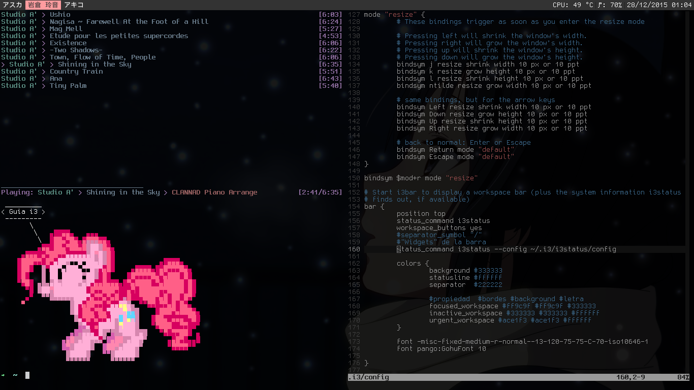

**Instalación**

Dependiendo la distribución se podrá encontrar e instalar el paquete i3 desde los repositorios.<!--more-->

**Iniciar**

Se tendrá que colocar i3 como entorno a iniciar en el script de inicio, en este caso será en el documento ~/.xinitrc en donde escribiremos:

```shell
exec i3
```

Si se tiene otro entorno indicado se tendrá que comentar con un #



Una vez iniciado i3 se podrán ejecutar los programas presionando la tecla Super (Windows) + d, lo que lanzará el programa dmenu. Para editar los archivos de configuración de i3 se tendrá que ejecutar un editor de texto desde dmenu.

**Configuración**

El archivo de configuración de i3 se encuentran en la ruta ~/.i3/config

Para cambiar el nombre de los espacios de trabajo es necesario editar las secciones switch to workspace y move focused container to workspace. Donde se tendrán que indicar exactamente los mismo nombres para cada espacio, reemplazando los números que vienen por defecto.

Dentro de bar{} podremos editar la configuración de la barra de i3, como la posición, tamaño, fuente, etc. En este caso se editarán los colores.

```shell
bar { position top status_command i3status workspace_buttons yes #separator_symbol "/"
#"Widgets" de la barra status_command i3status --config ~/.i3/i3status/config

colors { background #333333 statusline #ffffff separator  #222222
 
#propiedad  #bordes #background #letra focused_workspace #ff9c9f #ff9c9f #333333 inactive_workspace #333333 #333333 #ffffff urgent_workspace #ace1f3 #ace1f3 #ffffff }
 
font -misc-fixed-medium-r-normal--13-120-75-75-C-70-iso10646-1 font pango:GohuFont 10}
```

Si queremos quitar los bordes (azules por defecto) de i3, se tendrá que agregar lo siguiente al archivo de configuración:

```shell
new_window none
new_float none
```

Para controlar los colores de los indicadores de los espacios de trabajo se requiere poner lo siguiente (modificando los valores según las necesidades).

```shell
#class  border  backgr. text    indicator client.focused                   
#4c7899 #285577 #ffffff #2e9ef4 client.focused_inactive
#333333 #5f676a #ffffff #484e50 client.unfocused
#333333 #222222 #888888 #292d2e client.urgent
#2f343a #900000 #ffffff #900000 client.placeholder
#000000 #0c0c0c #ffffff #000000 client.background
#ffffff
```

**Modificar la apariencia (colores y fuente) de dmenu**

Por la línea 38 se encuentra # start dmenu (a program launcher) sección que podemos comentar completamente para editarla al final del archivo:

```shell
bindsym $mod+d exec dmenu\_run -sb '#ff9c9f' -sf '#333333' -nf '#ffffff' -fn 'GohuFont'
```

Para más información leer el manual de dmenu

```shell
$ man dmenu
```

**i3status**

Para poder editar los elementos de la barra se tendrá que editar el archivo `~/.i3/i3status/config` y para esto podremos sacar bastante información del manual de i3status que viene con algunos ejemplos que se podrán copiar y pegar en el archivo.

[https://i3wm.org/docs/userguide.html](https://i3wm.org/docs/userguide.html)
