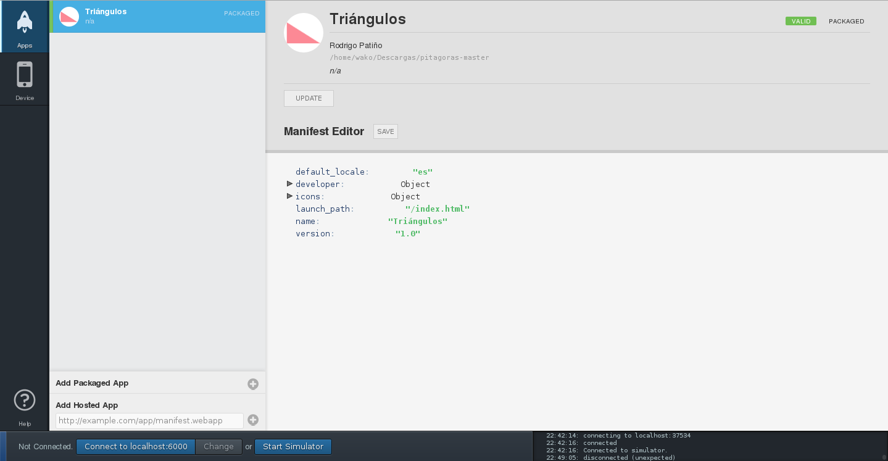

Hola, hoy les quiero enseñar lo sencillo que es hacer una aplicación para Firefox OS. El ejemplo es algo muy sencillo, pero servirá para comprender lo básico del desarrollo de aplicaciones web. <!--more-->Para empezar necesitaremos crear nuestra interfaz con HTML5 y CSS3 ya que la parte 'funcional' de nuestra aplicación será escrita con Javascript.

```html
<!DOCTYPE HTML>
<html>

<head>
  <meta charset="utf-8">
  <title>Triángulos</title>
  <link rel="stylesheet" href="style.css" />
  <script type="text/javascript" src="jQuery-min.js"></script>
  <script type="text/javascript" src="jQuery.js"></script>
</head>

<body> <!--TEOREMA-->
  <div id="teoremaContenedor">
    <header> <a href="#">
        <h2>Teorema de Pitágoras</h2>
      </a> </header>
    <div class="pregunta"> <!-- 1 cateto -->
      <div class="opciones" id="opcion1">
        <h2>Tienes 2 catetos</h2> <!--Comienza formulario 1-->
        <form action="javascript:validateForm()" class="formulario" id="formulario1"> <input type="number"
            id="obtHipCateto1" placeholder="Valor del Cateto a"><br> <input type="number" id="obtHipCateto2"
            placeholder="Valor del Cateto b"><br> <input id="enviar1" class="enviar" type="submit" value="¡Calcular!">
        </form>
      </div> <!-- 2 catetos -->
      <div class="opciones" id="opcion2">
        <h2>Tienes 1 cateto e hipotenusa</h2> <!--Comienza formulario 2-->
        <form action="javascript:validateForm()" class="formulario" id="formulario2"> <input type="number"
            id="obtCatCateto" placeholder="Valor del Cateto"><br> <input type="number" id="obtCatHipotenusa"
            placeholder="Valor de la Hipotenusa"><br> <input id="enviar2" class="enviar" type="submit"
            value="¡Calcular!"> </form>
      </div>
    </div> <!-- Resultados --> <a class="atras" href="#">←</a>
    <div class="resultados" id="resultadosTeorema">
      <h2>Resultado:</h2>
      <p>Cateto a: <span id="catAResultado"></span></p>
      <p>Cateto b:  <span id="catBResultado"></span></p>
      <p>Hipotenusa: <span id="hipResultado"></span></p>
    </div>
  </div> <!--TERMINA TEOREMA--> <!--Leyes-->
  <div id="leyesContenedor">
    <header> <a href="#">
        <h2>Leyes de los senos</h2>
      </a> </header>
    <div class="pregunta"> <!--2 lados y un ángulo-->
      <div class="opciones" id="opcion3">
        <h2>Tienes 2 lados y un ángulo</h2> <!--Comienza formulario 3-->
        <form action="javascript:validateForm()" class="formulario" id="formulario3"> <input type="number" id="leyLadoA"
            placeholder="Lado a"><br> <input type="number" id="leyLadoB" placeholder="Lado b"><br> <input type="number"
            id="leyAng" placeholder="Ángulo"><br> <input id="enviar3" class="enviar" type="submit" value="¡Calcular!">
        </form>
      </div> <!--termina 2 lados y un ángulo--> <!--2 ángulos y un lado-->
      <div class="opciones" id="opcion3">
        <h2>Tienes 2 ángulos y un lado</h2> <!--Comienza formulario 4-->
        <form action="javascript:validateForm()" class="formulario" id="formulario4"> <input type="number" id="leyAngA"
            placeholder="Ángulo a"><br> <input type="number" id="leyAngB" placeholder="Ángulo b"><br> <input
            type="number" id="leyLado" placeholder="Lado"><br> <input id="enviar4" class="enviar" type="submit"
            value="¡Calcular!"> </form>
      </div> <!--termina 2 ángulos y un lado-->
    </div> <!--Resultados--> <a class="atras" href="#">←</a>
    <div class="resultados" id="resultadosLeyes">
      <h2>Resultados:</h2>
      <p>Lado a: <span id=""></span></p>
      <p>Lado b:  <span id=""></span></p>
      <p>Lado c: <span id=""></span></p>
      <p>Ángulo a: <span id=""></span></p>
      <p>Ángulo b:  <span id=""></span></p>
      <p>Ángulo c: <span id=""></span></p>
    </div>
  </div> <!--Termina Leyes-->
</body>

</html>
```

Lo que vamos a hacer 'bonito' con CSS

```css
* {
  margin: 0px;
  padding: 0px;
}

body {
  background: #444;
  color: #fff;
}

a {
  text-decoration: none;
}

#preguntaToL a {
  margin: 50px;
}

header {
  width: 100%;
  background: #333;
}

header a {
  background: #333;
  padding: 15px;
  display: block;
  ;
  color: #fff;
}

.atras {
  color: #fff;
  position: absolute;
  margin: 5px;
  width: 50px;
  height: 50px;
  background: #333;
  border-radius: 5px;
  font-size: 40px;
  text-decoration: none;
  text-align: center;
  line-height: 45px;
}

#pregunta {
  width: 100%;
  float: left;
}

.opciones {
  width: 100%;
}

.opciones h2 {
  margin: 20px 15px;
}

.formulario {
  text-align: center;
}

input {
  margin: 10px 0;
  width: 90%;
  height: 30px;
  border: none;
  border-radius: 3px;
}

.enviar {
  background: #333;
  color: #fff;
}

.resultados {
  text-align: center;
  background: #333;
  width: 90%;
  margin: 70px auto;
  padding-bottom: 20px;
  border-radius: 3px;
}

.resultados h2 {
  margin: 10px;
  padding-top: 20px;
}

.resultados p {
  line-height: 28px;
}

.resultados span {
  color: red;
}
```

Ahora sólo falta nuestro script para hacer las funciones matemáticas. Para esto vamos a requerir descargar jQuery.

```javascript
$(document).ready(function () {
  /*Ocultamos las cosas*/
  $(".atras").hide(); $(".resultados").hide(); //$("#teoremaContenedor").hide(); $("#leyesContenedor").hide();

  /*Seleccionamos operación*/
  $("#teorema").click(function () { $("#preguntaToL").slideUp(500); $("#teoremaContenedor").slideDown(1000); }); $("#leyes").click(function () { $("#preguntaToL").slideUp(500); $("#leyesContenedor").slideDown(1000); });

  /*Ocultamos las opciones y aparecemos boton de retroceso*/
  $(".enviar").click(function () { $(".opciones").slideUp(300); $(".atras").slideDown(600); navigator.vibrate(500); }); $("#enviar1").click(function () {
    $("#resultadosTeorema").slideDown(600);
  });
  $("#enviar2").click(function () { $("#resultadosTeorema").slideDown(600); });
  $("#enviar3").click(function () { $("#resultadosLeyes").slideDown(600); });
  $("#enviar4").click(function () { $("#resultadosLeyes").slideDown(600); }
  );
  /*Regresamos*/
  $(".atras").click(function () {
    //$("#resultados").slideUp(300); //$(".opciones").slideDown(600); location.reload(); });

    /* OBTENER HIPOTENUSA*/
    $("#enviar1").click(function () { var a = $('#obtHipCateto1').val(); var b = $('#obtHipCateto2').val(); var hipoCuadrado = a * a + b * b; var hipo = (Math.sqrt(hipoCuadrado)); $("<span>" + a + "</span > ").appendTo("#catAResultado"); $(" < span > " + b + "</span > ").appendTo("#catBResultado"); $(" < span > " + hipo + "</span > ").appendTo("#hipResultado"); });

    /* OBTENER CATETO*/
    $("#enviar2").click(function () {
      var c = $('#obtCatCateto').val(); var d = $('#obtCatHipotenusa').val(); var cateCuadrado = d * d - c * c; var cate = (Math.sqrt(cateCuadrado));

      $("<span>" + c + "</span>").appendTo("#catAResultado"); $("<span>" + cate + "</span>").appendTo("#catBResultado"); $("<span>" + d + "</span>").appendTo("#hipResultado");
    });
  });
```

Ahora tenemos que crear nuestro archivo manifest.webapp en él pondremos los datos de nuestra aplicación

```json
{
  "version": "X",
  "name": "Nombre de la aplicación", "launch_path": "/index.html",
  "icons": {
    "16": "/img/icons/icono-16.png",
    "48": "/img/icons/icono-48.png",
    "128": "/img/icons/icono-128.png"
  },
  "developer": {
    "name": "Tu nombre",
    "url": "Tu sitio web"
  },
"default_locale": "es"
}
```

Con nuestros archivos listos podemos instalar la aplicación en el emulador. Para esto tenemos que entrar a la opción Desarrollador>App Manager o bien introducir about:app-manager en la barra de navegación. Primero tenemos que instalar el emulador haciendo click en el botón Iniciar Emulador, lo que nos indicará que no tenemos ninguno instalado y nos dará la opción de instalar alguno en sus distintas versiones de desarrollo. Ahora instalamos la aplicación escogiendo la opción de Aplicación empaquetada, elegimos su carpeta y listo.

 App Manager

[youtube https://www.youtube.com/watch?v=cRycHFodzJg&w=960&h=720]
