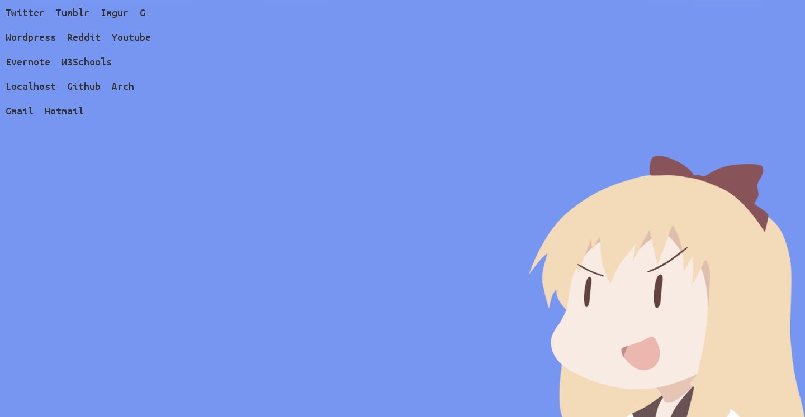

Para personalizar Firefox existen varias opciones como temas, extensiones y quitar herramientas de la interfaz. Pero lo que vamos a hacer es crear una página de inicio y new-tab personalizada.<!--more-->

Lo primero que tenemos que hacer crear nuestro HTML donde pondremos nuestros enlaces de interés e.g.

```html
<!DOCTYPE HTML>
<html>

<head>
  <meta charset="utf-8">
  <title>Inicio</title>
  <link rel="stylesheet" href="style.css" />
</head>

<body> <!--Comienza Sitio-->
  <div id="wrap">
    <div id="hover">
      <div id="urls">
        <ul>
          <li><a href="https://tweetdeck.twitter.com/">Twitter</a></li>
          <li><a href="http://tumblr.com/">Tumblr</a></li>
          <li><a href="http://imgur.com">Imgur</a></li>
          <li><a href="https://plus.google.com/u/0/">G+</a></li>
          <li><a href="http://moelinux.wordpress.com/wp-admin">Wordpress</a></li>
          <li><a href="http://www.reddit.com/">Reddit</a></li>
          <li><a href="http://youtube.com/">Youtube</a></li>
          <li><a href="https://www.evernote.com/Home.action">Evernote</a></li>
          <li><a href="http://www.w3schools.com">W3Schools</a></li>
          <li><a href="http://localhost">Localhost</a></li>
          <li><a href="http://github.com">Github</a></li>
          <li><a href="https://wiki.archlinux.org">Arch</a></li>
          <li><a href="https://mail.google.com/mail/u/0/?tab=wm&pli=1#inbox">Gmail</a></li>
          <li><a href="https://blu172.mail.live.com/">Hotmail</a></li>
        </ul>
      </div>
    </div>
  </div> <!--Termina Sitio-->
</body>

</html>
```

Ahora vamos a darle formato con CSS.

```css
* {
  margin: 0;
  padding: 0;
}

body {
  background: url("bg.jpg");
  background-size: 100% 100%;
}

a {
  color: #333;
  font-size: 20px;
  padding: 10px;
  display: block;
  text-decoration: none;
  outline: none;
  -moz-transition: .8s background, .4s color;
}

a:hover {
  color: #fff;
  -moz-transition: .4s background, .2s color;
}

ul {
  list-style: none;
}

li {
  float: left;
}

#wrap {
  width: 100%;
  height: 100vh;
}

#hover {
  width: 300px;
  height: 100vh;
}

#urls {
  width: 300px;
  height: 100vh;
  margin-left: -50vw;
  -moz-transition: .8s all;
}

#hover:hover>#urls {
  margin-left: 0;
  -moz-transition: .4s all;
}
```

**Para que la propiedad background:url("bg.jpg"); funcionen deben tener una imagen llamada bg.jpg en la misma carpeta donde está su archivo HTML**

Lo último que tenemos que hacer es entrar a about:config y buscar browser.newtab.url y browser.startup.homepage para cambiar su valor a la dirección en el disco duro de nuestro archivo HTML. Ahora ya tenemos una página de inicio y de nueva pestaña completamente personalizada.

[](https://moelinux.files.wordpress.com/2014/08/inicio-2014-08-20-00-13-12.png) Pantalla de inicio Firefox

[embed]https://www.youtube.com/watch?v=DW0SjIPwVOc\[embed]

¿Y cómo es la página de inicio de ustedes?
