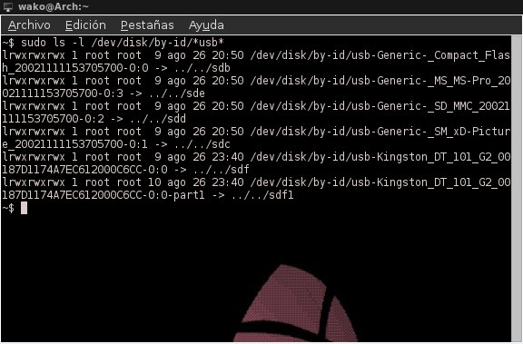
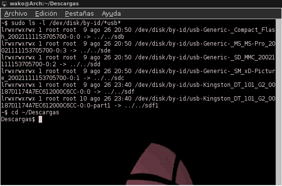

Cuando uno quiere quemar una imagen iso en su sistema operativo Linux e.g. Debian; uno busca en Internet como hacerlo y encuentra post que dicen que tienes que instalar X o Y programa para hacer algo que puedes hacer desde la terminal sin instalar absolutamente nada porque ya viene instalado con tu sistema.<!--more-->

Abriremos nuestra terminal y escribiremos

sudo ls -l /dev/disk/by-id/\*usb\*

En mi caso la usb es la sdf **(Es importante ignorar el número e.g. sdf1).** Ahora tenemos que transladarnos a la carpeta donde tenemos nuestra iso e.g. Descargas

cd ~/Descargas

Ahora sí podremos quemar la iso.

sudo dd if=nombreDeLaIso.iso of=/dev/elUsb bs=4M; sync

Por ejemplo: Si yo quisiera quemar la iso de Elementary OS podría renombrar mi archivo iso en el explorador de archivos a elementary.iso y con mi usb siendo sdf quedaría algo como:

sudo dd if=elementary.iso of=/dev/sdf bs=4M; sync

El proceso tarda un rato y cuando termine en la terminal saldrá algo como: **X bloques fueron copiados a SDF.** Y con estos 3 comandos ya tenemos nuestra usb lista para bootearse sin isntalar nada extra en nuestro sistema.
