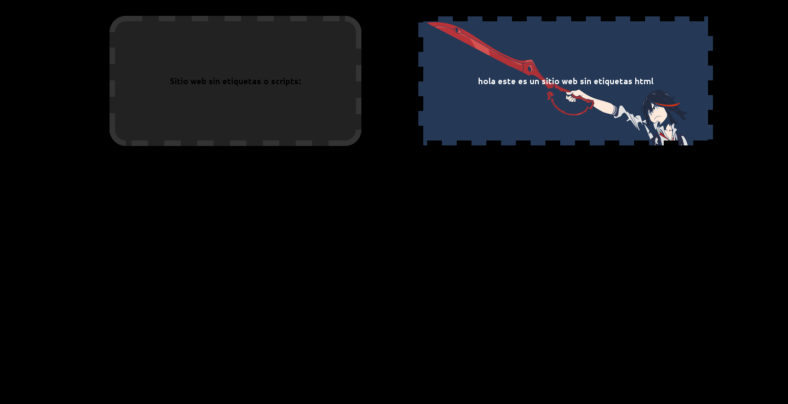

Se puede hacer un sencillo sitio web sin hacer uso de las etiquetas html o scripts, de hecho no se requiere tener absolutamente nada más que un html sin contenido dentro de `<body>` y una hoja de estilo. <!--more-->

Para esto tendremos que editar la etiqueta <body> con los atributos before y after. e.g.

```css
body{
  background:#000;
  line-height:100px;
  margin:100px;
  font-weight:bold;
}

body:before{
  content:"Sitio web sin etiquetas o scripts:";
  padding:100px; margin:100px;
  background:#222;
  border:10px dashed #333;
  border-radius:30px;
} 

body:after{
  border:9px dashed #000;
  content:"hola este es un sitio web sin etiquetas html";
  padding:100px;
  color:#fff;
  background:url("bg.png") 0 -10px;
  background-size:100%;
}
```

[](https://moelinux.files.wordpress.com/2014/09/captura-de-pantalla-090914-160318.png) Sitio web sin etiquetas
