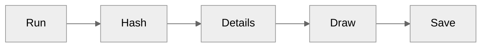
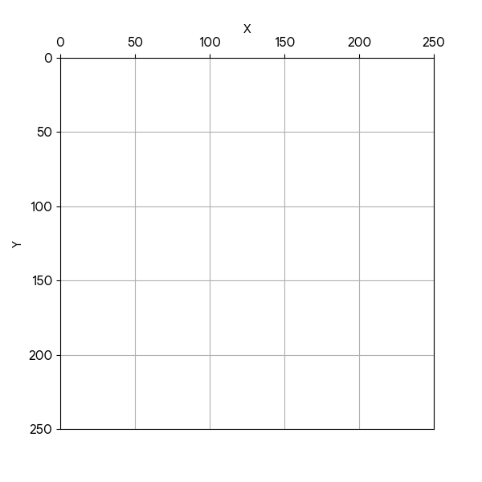
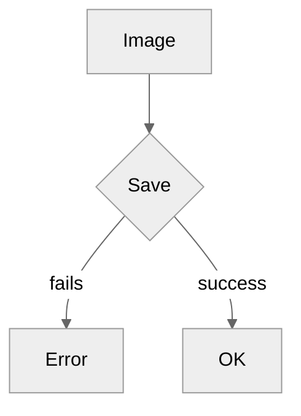

<!--more-->

> [!Identicon]
> An Identicon is a visual representation of a hash value, usually of an IP address, that serves to identify a user of a computer system as an effectively random form of avatar while protecting the user's privacy. The original Identicon was a 9-block graphic, and the representation has been extended to other graphic forms by third parties.

## Description

This project aims to show how to implement an algorithm to create an *identicon* using Rust. Some common usages for this kind of images can be found on [Github](https://github.com) or [Grafana](https://grafana.com) where they use them to generate a profile picture for users who haven't upload a profile picture. You can find a collection of different projects and libraries to create them [here](https://github.com/drhus/awesome-identicons).

As the definition says an *identicon* represents a hash value. That means that this process is kind of determinstic, and I say kind of, because since we are creating an image we depend on external states like memory, file system, space disk, etc. But the algorithm that generates the information that we are passing to the image creation is determinstic.

For example if we use the word `wako` in our algorithm, it's going to produce the same information every time. That information is passed to a function that creates an image and save it in disk.


If you are interested in check your github's identicon, you can use this site:

[https://github.com/identicons/\<username\>.png](https://github.com/identicons/4k1k0.png)

## The algorithm

This proccess needs to receive a string as an input and generate the information that will be used to create an image in disk. This information contains data such as RGB color and coordanates that will produce the final image. 



A hash is <content...>. If we pass the string `wako` for a hash function like [md5](https://www.md5hashgenerator.com/) we get the result:

```shell
b938719549150aafed74a90a0aa5ef27
```

This happens because *md5* algorithm is determinstic and always returns a list of 16 hexadecimal numbers for the same input.


With the [md5](https://crates.io/crates/md5) package.

```rust
md5::compute("wako").0;
```

```shell
18556113149732110175237116169101016523939
```

| decimal | hex |
|:-:|:-:|
| 185 | b9 |
| 56 | 38 |
| 113 | 71 |
| 149 | 95 |
| 73 | 49 |
| 21 | 15 |
| 10 | 0a |
| 175 | af |
| 237 | ed |
| 116 | 74 |
| 169 | a9 |
| 10 | 0a |
| 10 | 0a |
| 165 | a5 |
| 239 | ef |
| 39 | 27 |

### Color

In order to get the color for our *identicon* we will take the first three numbers, or any combination of indexes, to get the RGB values. Those values can be used in decimal format or hexadecimal format.

| base | r | g | b |
|:-:|:-:|:-:|:-:|
| decimal | 185 | 56 | 113 |
| hex | b9 | 38 | 71 |

[ or #b93871")](https://www.colorhexa.com/b93871)

We can store that information inside a *struct*, where each field represent a RGB value which already know are 8 bits numbers.

```rust
pub struct Color {
    pub r: u8,
    pub g: u8,
    pub b: u8,
}

pub fn new(hash: [u8; 16]) -> Color {
    Color {
        r: hash[0],
        g: hash[1],
        b: hash[2],
    }
}
```

### Image details

Our algorithm will use the original list of numbers to get the values to process our image. We will use the values alongside with a group of pure functions that will process that list and create the input for our image.

```shell
[185, 56, 113, 149, 73, 21, 10, 175, 237, 116, 169, 10, 10, 165, 239, 39]
```

First we need to create a groups of 3 elements from that list. Since the original list has 16 elements we will get only 5 groups.

```rust
fn split(hex: [u8; 16]) -> [[u8; 3]; 5] {
    let mut result = [[0u8; 3]; 5];
    for (i, chunk) in hex.chunks_exact(3).take(5).enumerate() {
        result[i].copy_from_slice(chunk);
    }

    result
}
```

Our transformed list:

```shell
[
  (185, 56, 113),
  (149, 73, 21),
  (10, 175, 237),
  (116, 169, 10),
  (10, 165, 239),
]
```

Later we can process each group, transforming each group of 3 elements to 5 elements. We need to mirror the first and second element into the fourth and fifth. That's the same as appending the second and first index at the end of the original group.

```goat
   .---------------------------------.
   |       .----------------.        |
   |       |                |        |
.--+--.  .-+--.  .-----.    |        |
| 185 |  | 56 |  | 113 |    |        |
'--+--'  .-+--.  .--+--.    |        |
   |       |        |       |        |
   v       v        v       v        v
.-----.  .----.  .-----.  .----.  .-----.
| 185 |  | 56 |  | 113 |  | 56 |  | 185 |
'-----'  .----.  .-----.  .----.  .-----.
```

So in code it looks like this:

```rust
fn mirror_row(row: [u8; 3]) -> [u8; 5] {
    let mut res = [0u8; 5];
    res[0] = row[0];
    res[1] = row[1];
    res[2] = row[2];
    res[3] = row[1];
    res[4] = row[0];

    res
}
```

Result:

```shell
[
  (185, 56, 113, 56, 185),
  (149, 73, 21, 73, 149),
  (10, 175, 237, 175, 10),
  (116, 169, 10, 169, 116),
  (10, 165, 239, 165, 10),
]
```

Next we need to flat the groups into a single list.

```rust
fn list_flaten(rows: [[u8; 5]; 5]) -> [u8; 25] {
    let mut res = [0u8; 25];
    let flat_iter = rows.iter().flatten();
    for (i, &byte) in flat_iter.enumerate() {
        res[i] = byte;
    }

    res
}
```

We get:

```shell
[185, 56, 113, 56, 185, 149, 73, 21, 73, 149, 10, 175, 237, 175, 10, 116, 169, 10, 169, 116, 10, 165, 239, 165, 10]
```

We need to keep track of each value and its index. For that we will create a new data type called *Point* that contains a value and its index.

```rust
pub type Point (u8, usize);
```

We will process the new flatten list to get a new list of points.

```rust
fn with_index(list: [u8; 25]) -> [Point; 25] {
    let mut points: [Point; 25] = [(0, 0); 25];
    for (i, &element) in list.iter().enumerate() {
        points[i] = (element, i);
    }

    points
}
```

```shell
[
    (185, 0),
    (56, 1),
    (113, 2),
    (56, 3),
    (185, 4),
    (149, 5),
    (73, 6),
    (21, 7),
    (73, 8),
    (149, 9),
    (10, 10),
    (175, 11),
    (237, 12),
    (175, 13),
    (10, 14),
    (116, 15),
    (169, 16),
    (10, 17),
    (169, 18),
    (116, 19),
    (10, 20),
    (165, 21),
    (239, 22),
    (165, 23),
    (10, 24)
]
```

Then we filter the records and we keep only the even ones.

```rust
fn filter_even_points(points: [Point; 25]) -> Vec<Point> {
    points.into_iter().filter(|(a, _b)| a % 2 == 0).collect()
}
```

That shall give us:

```shell
[
    (56, 1),
    (56, 3),
    (10, 10),
    (10, 14),
    (116, 15),
    (10, 17),
    (116, 19),
    (10, 20),
    (10, 24)
]
```

Finally we need to create the *PixelMap* that will be used to create our image. This *PixelMap* contains information about the coordinates that will use alongside with the `image` libarary to our *identicon*.

```rust
pub type Point = (usize, usize);
pub type PixelMap = (Point, Point);

pub fn new(points: &Vec<grid::Point>) -> Vec<PixelMap> {
    points.iter().map(new_pixel_map).collect()
}

fn new_pixel_map((_x, index): &grid::Point) -> PixelMap {
    let horizontal = (index % 5) * 50;
    let vertical = (index / 5) * 50;
    let top_left: Point = (horizontal, vertical);
    let bottom_right: Point = (horizontal + 50, vertical + 50);
    (top_left, bottom_right)
}
```

This generates the final *PixelMap*:
```shell
[
  ((50, 0), (100, 50)),
  ((150, 0), (200, 50)),
  ((0, 100), (50, 150)),
  ((200, 100), (250, 150)),
  ((0, 150), (50, 200)),
  ((100, 150), (150, 200)),
  ((200, 150), (250, 200)),
  ((0, 200), (50, 250)),
  ((200, 200),(250, 250))
]
```

That *PixelMap* represents pairs of coordinates in a plane. Each pair of coordinates indicates where to start and finish a square inside the canvas and fill it with our *Color* value.



### Generate the image

For this we will use the [image](https://crates.io/crates/image) crate.

```rust
use crate::identicon::{color, pixel};
use image::{ImageBuffer, Rgb, RgbImage};

pub fn new(color: &color::Color, pixel_map: &Vec<pixel::PixelMap>) -> RgbImage {
    let mut img = ImageBuffer::<Rgb<u8>, Vec<u8>>::from_pixel(250, 250, Rgb([255, 255, 255]));

    let pixel = Rgb([color.r, color.g, color.b]);

    for (point_a, point_b) in pixel_map {
        let x1 = point_a.0 as u32;
        let y1 = point_a.1 as u32;

        let x2 = point_b.0 as u32;
        let y2 = point_b.1 as u32;

        for x in x1..x2 {
            for y in y1..y2 {
                img.put_pixel(x, y, pixel);
            }
        }
    }

    img
}
```


### Save the image in disk

This is the part of the process that is not determinstic. Although the entire algorithm that receive the input string and generates the image details is referentially transparent, saving the image in the disk, upload the image to a cloud service or send the image to a external process over the network is not referentially transparent since it relys on an external state. This process could fail due to multiple reasons like not enought disk space, an error with the file system, wrong permissions to write in disk, etc.



```rust
pub fn save(&self) -> Result<(), image::ImageError> {
    self.image.save(&self.filename)
}
```

## References

- [Stack Overflow](https://stackoverflow.com/questions/65122991/official-github-identicon-algorithm)
- [Functional Programming: What Is Referential Transparency?](https://dezmereanrobert.com/posts/referential-transparency/)
