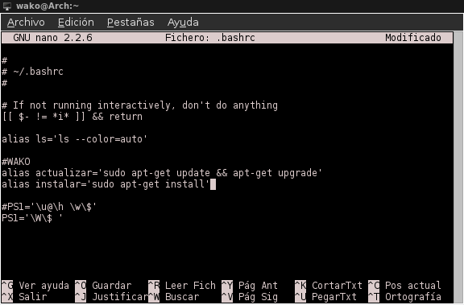

Si eres un nuevo usuario de Linux posiblemente no sepas qué son los alias y para que pueden ser utilizados.<!--more-->

Si eres usuario de Ubuntu, Debian, Chrunchbang, Linux Mint, etc. seguramente habrás hecho uso de los comando apt-get update, apt-get upgrade o apr-get install. Bueno pues resulta que existe una manera muy sencilla de hacer de esto algo mucho más simple. Para eso abriremos nuestro editor de texto favorito, en este caso utilizaré nano y editaremos nuestro archivo .bashrc que se encuentra en nuestra carpeta home.

\[caption id="" align="alignnone" width="576"\] Alias\[/caption\]

De esta manera sólo tendremos que abrir terminal y escribir actualizar para actualizar el software del equipo o instalar "nombre del paquete" para instalar algún programa. Uno puede crear alias para lo que quiera. Espero que les sea de utilidad.
